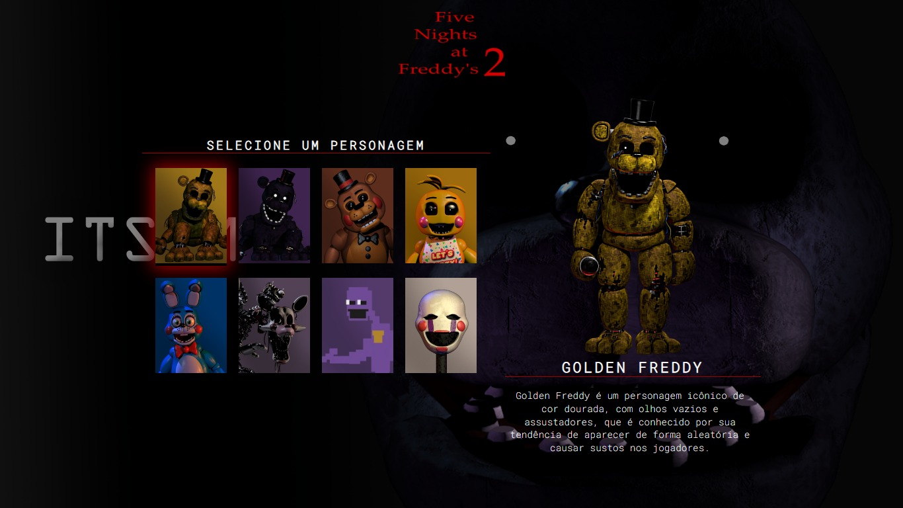

<h1 align="center">Five Night s at Freddy 2 </h1>
Durante a Semana do Zero do Programador Contratado, promovida pelo [Dev em Dobro](https://github.com/devemdobro), tive a oportunidade de desenvolver um projeto temático baseado nos X-Men. No entanto, decidi personalizá-lo e escolhi como inspiração o popular jogo Five Nights at Freddy's 2.

## Imagem do projeto

  

## Tecnologias usadas

- HTML
- CSS
- JavaScript

## Site

> [Clique aqui para visualizar o projeto!](https://vaporubberg.github.io/Five-Night-s-at-Freddy-2/)
